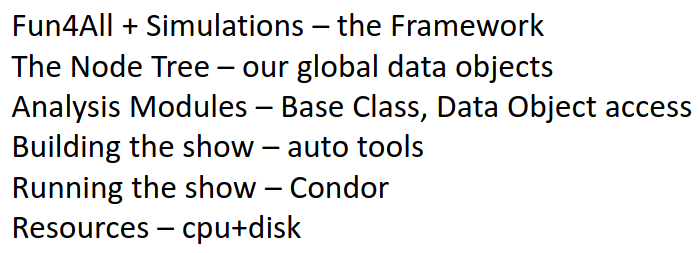
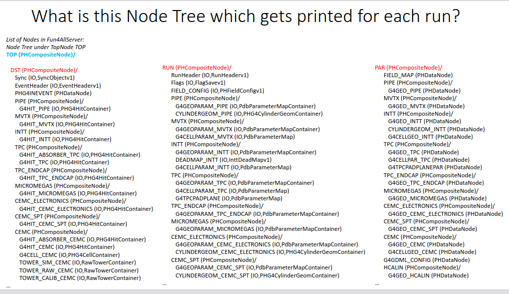

# Fun4All

The workflow is as follows:



The link to Fun4All offline framework in github page is [here](https://github.com/sPHENIX-Collaboration/coresoftware/tree/master/offline/framework).

For details understanding of Fun4all, read [here](tutorial_sphenix_computing_dec_2022.pdf).

The available **nodes** in the TopNode are as shown:



## How to navigate the Node Tree to include in my analysis module?

You need to know the **name of the node** and the **class of the object** you want (e.g. `PHG4HitContainer` is a class of the object and `G4HIT_HCALIN` is a node)

Let's look what you should have inside your `.cc` file:

```cpp
#include <g4hit/PHG4HitContainer.h>   // header for object
#include <fun4all/getClass.h>   // to get the class node

MyAnalysis::process_event(PHCompositeNode *topNode)
{
    // accessing nodes:
    PHG4HitContainer *g4hits = findNode::getClass<PHG4HitContainer>(topNode, "G4HIT_HCALIN");
    
    // grad the track node and loop over all tracks
    SvtxTrackMap *_g4tracks = findNode::getClass<SvtxTrackMap>(topNode, "SvtxTrackMap");
    if (!_g4tracks)
    {
        std::cerr << PHWHERE << " ERROR: Can't find SvtxTrackMap." << std::endl;
        return Fun4AllReturnCodes::ABORTEVENT;
    }
    
    for (SvtxTrackMap::Iter iter=_g4tracks->begin();
        iter != _g4tracks->end();
        ++iter)
    {
        SvtxTrack *track = &iter->second();
        
        // do the stuff with tracks now, see SvtxTrack.h to know what you
        // can do.
        track->identify();
    }
    
    // grad the CEMC cluster node and loop over all clusters
    RawClusterContainer *clusterList = findNode::getClass<RawClusterContainer>(topNode, "CLUSTER_CEMC");
    
    if(!clusterList)
    {
        std::cerr << PHWHERE << " ERROR: Can't find node CLUSTER_CEMC" << std::endl;
    }
    
    
    // Get the reconstructed tower jets
    JetMap *reco_jets = findNode::getClass<JetMap>(topNode, "AntiKt_Tower_r04");
    
    // Get the truth jets
    JetMap *truth_jets = findNode::getClass<JetMap>(topNode, "AntiKt_Truth_r04");
    
    // Object type (JetMap), Node tree to search (topNode), Node name on
    // node tree (AntiKt_Truth_r04)
    
    // with the nodes you can analyze it:
    /// Iterate over the reconstructed jets
    for (JetMap::Iter recoIter = reco_jets->begin();
        recoIter != reco_jets->end();
        ++recoIter)
    {
        Jet *recoJet = recoIter->second;
        m_recojetpt = recoJet->get_pt();
        if (m_recojetpt < m_minjetpt)
            continue;
    }
    
}
```

## How to build a package?

1. Set up your environment to understand sPHENIX build by running the following script.
```bash
> source $OPT_SPHENIX/bin/sphenix_setup.csh (or sh) -n
```
The above step will get all the Fun4all libraries ready for you.

2. create install directory in `/user/<sPHENIX_user_name>/install`.
Making the install dir in user account because it has 5 TB of storage, your `/u/` home directory only has 3 GB.

3. once the analysis module has be all written; create a build directory inside the analysis module, then run autogen with prefix pointing to the install area

4. then, do `make install`

5. finally do, source this local script to tell that when running the Fun4all macro, first look into the local area for the relevant class (might be your analysis module which spHENIX don't have them). To source this script
```bash
$ source $OPT_SPHENIX/bin/setup_local.csh (or sh) $MYINSTALL

// note: $MYINSTALL has to be pointing to your install dir
// do this: MYINSTALL=/path/to/your/install/
```

6. Now, you should be able to run the Fun4all macro.


## More info. on DST nodes and the node names
Found in this page [here](https://wiki.sphenix.bnl.gov/index.php/Example_of_using_DST_nodes). It also has information about how to build analysis package.
